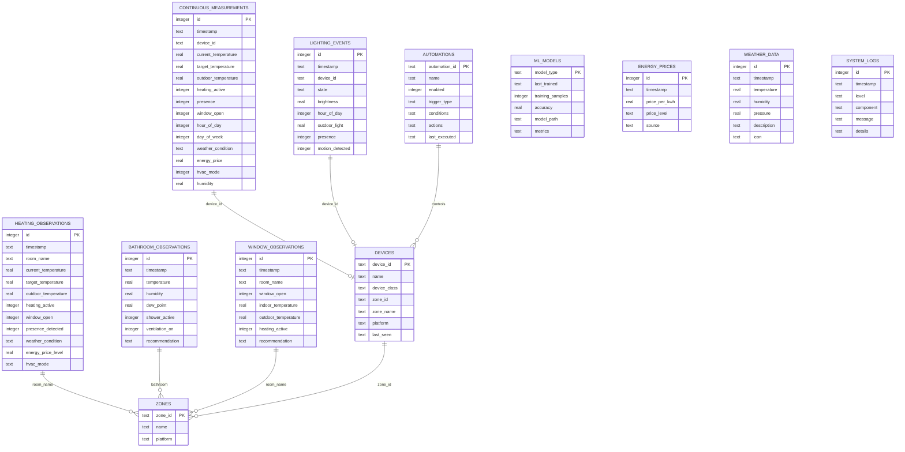

# Database Schema

Diagramm der Datenbankstruktur für das KI Smart Home System.

## Entity Relationship Diagram



## Tabellen-Details

### 1. continuous_measurements
**Zweck:** ML-Trainingsdaten für Temperaturmodell  
**Sammlung:** Alle 5 Minuten (TemperatureDataCollector)  
**Größe:** ~100k Einträge/Jahr  
**Indizes:** `idx_continuous_timestamp`, `idx_continuous_device`

### 2. lighting_events
**Zweck:** ML-Trainingsdaten für Beleuchtungsmodell  
**Sammlung:** Bei Zustandsänderungen (LightingDataCollector, 60s Intervall)  
**Größe:** ~50k Einträge/Jahr  
**Indizes:** `idx_lighting_timestamp`, `idx_lighting_device`

### 3. heating_observations
**Zweck:** Heizungs-Analytics und historische Daten  
**Sammlung:** Alle 15 Minuten (HeatingDataCollector)  
**Größe:** ~35k Einträge/Jahr  
**Indizes:** `idx_heating_timestamp`, `idx_heating_room`

### 4. bathroom_observations
**Zweck:** Schimmelprävention und Luftfeuchtigkeit-Monitoring  
**Sammlung:** Alle 5 Minuten (BathroomDataCollector)  
**Größe:** ~100k Einträge/Jahr  
**Indizes:** `idx_bathroom_timestamp`

### 5. window_observations
**Zweck:** Fenster-offen-Erkennung und Heizungsoptimierung  
**Sammlung:** Bei Zustandsänderungen (WindowDataCollector)  
**Größe:** ~10k Einträge/Jahr  
**Indizes:** `idx_window_timestamp`

### 6. devices
**Zweck:** Geräte-Registry (Homey & Home Assistant)  
**Aktualisierung:** Bei jedem API-Call  
**Größe:** ~100 Einträge

### 7. zones
**Zweck:** Raum-/Zonen-Verwaltung  
**Aktualisierung:** Selten  
**Größe:** ~10 Einträge

### 8. automations
**Zweck:** Automatisierungs-Verwaltung  
**Aktualisierung:** Bei Änderungen durch UI  
**Größe:** ~20 Einträge

### 9. ml_models
**Zweck:** Metadaten zu trainierten ML-Modellen  
**Aktualisierung:** Bei Training  
**Größe:** 2 Einträge (Lighting, Temperature)

### 10. energy_prices
**Zweck:** Energiepreis-Historie (aWATTar)  
**Sammlung:** Stündlich (EnergyPriceCollector)  
**Größe:** ~8k Einträge/Jahr  
**Indizes:** `idx_energy_timestamp`

### 11. weather_data
**Zweck:** Wetterdaten (OpenWeatherMap)  
**Sammlung:** Alle 30 Minuten (WeatherCollector)  
**Größe:** ~17k Einträge/Jahr  
**Indizes:** `idx_weather_timestamp`

### 12. system_logs
**Zweck:** System-Logging (optional)  
**Sammlung:** Bei Events  
**Größe:** Variable

## Datenfluss


## Speicherplatz-Schätzungen

| Zeitraum | Geschätzte DB-Größe |
|----------|---------------------|
| 1 Woche  | ~5 MB               |
| 1 Monat  | ~20 MB              |
| 3 Monate | ~60 MB              |
| 1 Jahr   | ~250 MB             |
| 2 Jahre  | ~500 MB             |

## Wartung

### Automatisches Cleanup
```python
# In database_maintenance.py
db.cleanup_old_data(days=365)  # Läuft täglich
```

### Manuelle Wartung
```bash
# VACUUM (Defragmentierung)
sqlite3 data/ki_system.db "VACUUM;"

# Größe prüfen
du -h data/ki_system.db

# Tabellengrößen
sqlite3 data/ki_system.db "SELECT name, SUM(pgsize) FROM dbstat GROUP BY name;"
```

## Performance-Optimierungen

### WAL-Modus (Write-Ahead Logging)
```sql
PRAGMA journal_mode=WAL;
```
Bessere Concurrency für Read/Write-Zugriffe.

### Indizes
Alle kritischen Tabellen haben Timestamp- und Device-ID-Indizes.

### Prepared Statements
Alle Queries verwenden Parameterized Statements (SQL-Injection-Schutz).

## Migrationen

Siehe `src/utils/migrations/` für Schema-Änderungen:
- `001_add_continuous_measurements.sql`
- `002_add_heating_observations.sql`
- `003_add_window_observations.sql`

Neue Migrationen werden automatisch bei Start erkannt und ausgeführt.
